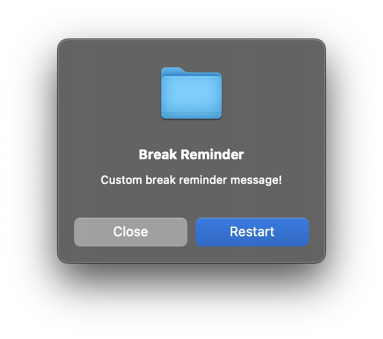

# take-a-break

Python command line tool to remind you to take breaks when working. Currently only tested on MacOS.

### Quick setup (MacOS/Linux)

Open the `take-a-break` folder after downloading and run the following command in the terminal: `./setup.sh`

OR

```
git clone https://github.com/JasonEl1/take-a-break.git
cd take-a-break
./setup.sh
```

### How to use the tool:

Use the tool using the name `work`. The following commands are available:

```
work get                -> get current state of work mode (set / unset)
work set                -> set work mode with default interval of 20 minutes
work set -t value       -> set work mode with a specific reminder interval (minutes)
work unset              -> unset work mode
work next               -> get  time remaining until next reminder
work log                -> get all productivity log entries
work message            -> get current reminder message
work message -m message -> set reminder message to custom string
work -h                 -> show help page
```

> [!TIP]
> Use `work message -m default` to set reminder message back to default

When `work mode` is enabled, you will be reminded to take a break from your work via a popup window at a certain time interval. You will also be prompted to (optionally) log how productive you think you were since the previous break.

The program will remind you to take a break after the specified time interval with the option to reset the reminder or unset work mode. The program does not continue running after `work set` is called, but makes use of cron to schedule the reminder at the correct time.



### Uninstallation

Use the command `work uninstall` and follow the prompts.
